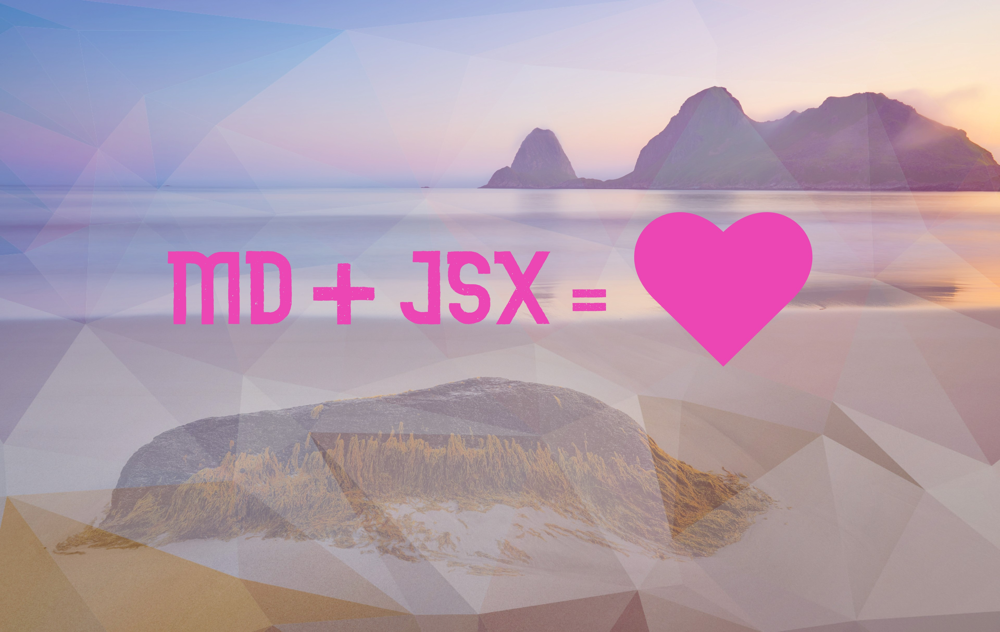

## What is MDX

MDX is markdown with support for JSX. It is a super flexible language that allows you the terseness of markdown and the advanced functionality of React components.

## Why use MDX

add more here...

## How to Add MDX to a Gatsby Site

There is a good instructions on the [Gatsby docs](https://www.gatsbyjs.org/docs/mdx/)
[Gatsby plugin](https://www.gatsbyjs.org/packages/gatsby-plugin-mdx/)

- download mdx plugin for vscode. I used [MDX](https://github.com/silvenon/vscode-mdx)

- add to VScode settings

```JSON
"files.associations": {
     "*.md": "mdx"
   },
```

## How to Add Images to MDX Posts

Note: This guide assumes that the images are located in the same directory relative to the post file.

- Install the [gatsby-remark-images](https://www.gatsbyjs.org/packages/gatsby-remark-images/) plugin.

```Shell
  npm i gatsby-remark-images
```

- Configure your gatsby-plugin-mdx pluing in your gatsby-config.js file. If you haven't already installed gatsby-plugin-mdx instructions to do so are at the start of this post. There are a ton of customizations you can do so I suggest reading through the documentation. Two options that I found especially useful were maxWidth and quality.

```Javascript
// gatsby-config.js
module.exports = {
  plugins: [
    {
      resolve: `gatsby-plugin-mdx`,
      options: {
        defaultLayouts: {
          default: require.resolve("./src/components/layout.js"), // path to layout template
        },
        gatsbyRemarkPlugins: [
          {
            resolve: `gatsby-remark-images`,
            options: {
            // It's important to specify the maxWidth (in pixels) of
            // the content container as this plugin uses this as the
            // base for generating different widths of each image.
            maxWidth: 960,
            quality: 80
            },
          },
        ],
      },
    },
  ],
}
```

At the writing of this guide(Aug 2019) there is a [bug](https://github.com/gatsbyjs/gatsby/issues/15486) about how gatsby deals with sub-plugins that may effect how gatsby-remark-images renders to the page. If you are seeing a lot of white space above your image add the following line below.

```Javascript
// gatsby-config.js
module.exports = {
  plugins: [
    {
      resolve: `gatsby-plugin-mdx`,
      options: {
        defaultLayouts: {
          default: require.resolve("./src/components/layout.js"),
        },
        plugins: [`gatsby-remark-images`], // <- add this line
        gatsbyRemarkPlugins: [
          {
            resolve: `gatsby-remark-images`,
            options: {
            // It's important to specify the maxWidth (in pixels) of
            // the content container as this plugin uses this as the
            // base for generating different widths of each image.
            maxWidth: 960,
            quality: 80
            },
          },
        ],
      },
    },
  ],
}
```

- Now you can add your image directly inside your MDX file using regular markdown.

```Markdown
---
title: Sample Posts
slug: sample-post
author: John Smith
---


```

- Restart your dev server for the changes to your config file to come into effect.

Viola! Now you should be seeing your image and it should also be fully optimized with gatsby-image. There are a ton of custimizable options

- (Optional) Add relative path to an image in your post frontmatter this step is useful if you want to query the image via graphql elsewhere

```Markdown
---
title: Sample Posts
slug: sample-post
author: John Smith
image: ./your-image-here <!--- relative path to image --->
---
```

## add images to a page or post preview page

- install [gatsby-image](https://www.gatsbyjs.org/packages/gatsby-image/?=gatsby-image)

```Shell
  npm i gatsby-image
```

This plugin requires gatsby-transformer-sharp and gatsby-plugin-sharp to function. These are both common plugins and it is likely that you already have them installed and configured. If not, the neccesary steps to set them up are below.

```Shell
npm i gatsby-transformer-sharp gatsby-plugin-sharp
```

Update your gatsby-config.js file to include the dependencies, and make sure that your source plugin is configured to your image directory. This will help enable graphql queries for the images.

```javascript
// gastby-config.js
module.exports = {
  plugins: [
    {
      resolve: `gatsby-source-filesystem`,
      options: {
        name: `images`,
        path: `${__dirname}/src/images`, // path to image folder
      },
    },
    `gatsby-plugin-sharp`,
    `gatsby-transformer-sharp`,
  ],
}
```
